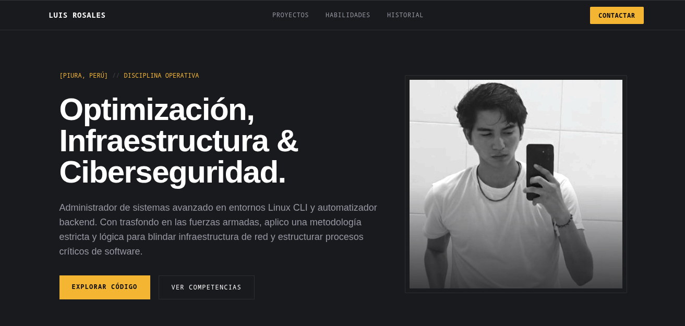

Este repositorio contiene el código fuente de mi portafolio profesional independiente, diseñado bajo una arquitectura minimalista de alto impacto basada en componentes modulares y optimizada para la conversión técnica.

## 🌐 Despliegue en Vivo

Puedes acceder e interactuar con la plataforma completamente operativa a través del siguiente enlace:
👉 **[Ver Portafolio en Producción](https://alberth-23.github.io/Perfil_web/)**

---

## 📸 Previsualización de la Interfaz

A continuación se muestra el diseño estructural asimétrico y la paleta de colores premium en negro carbón y ámbar dorado implementados:

---

## 🛠️ Stack Tecnológico Utilizado

*   **Maquetación Lógica:** HTML5 semántico estructurado para SEO técnico y accesibilidad.
*   **Estilos y Layout:** Tailwind CSS integrado mediante tokens de diseño personalizados para garantizar la armonía visual de los contrastes.
*   **Interactividad y Animaciones:** AOS (Animate On Scroll) Library para la transición controlada de componentes CLI y Lucide Icons para la simbología técnica.
*   **Automatización de Datos:** Integración nativa con la API REST de GitHub para renderizar repositorios activos en tiempo real sin intervención manual.